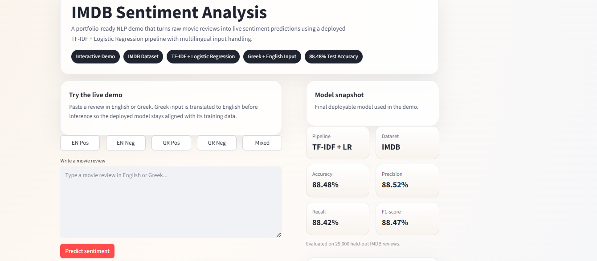
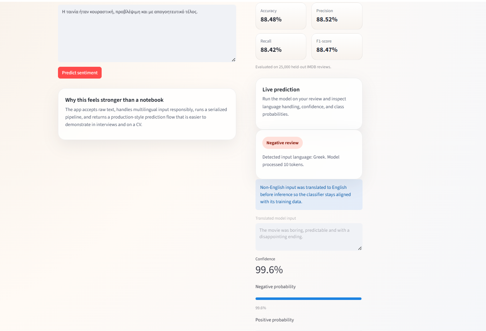
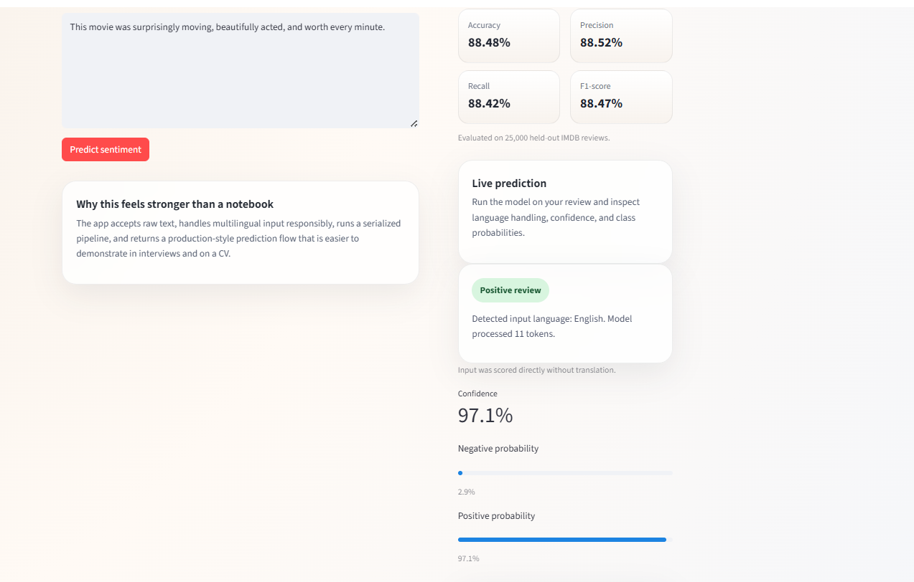
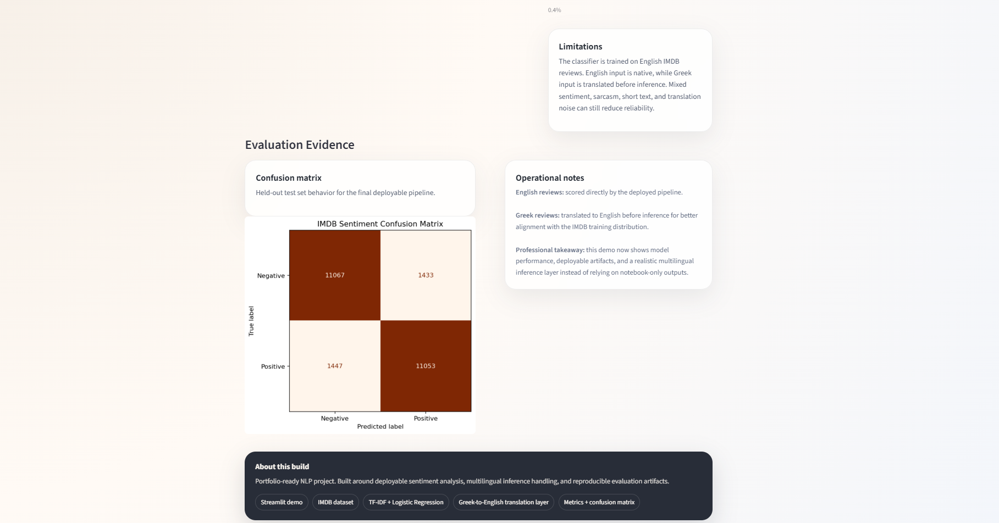
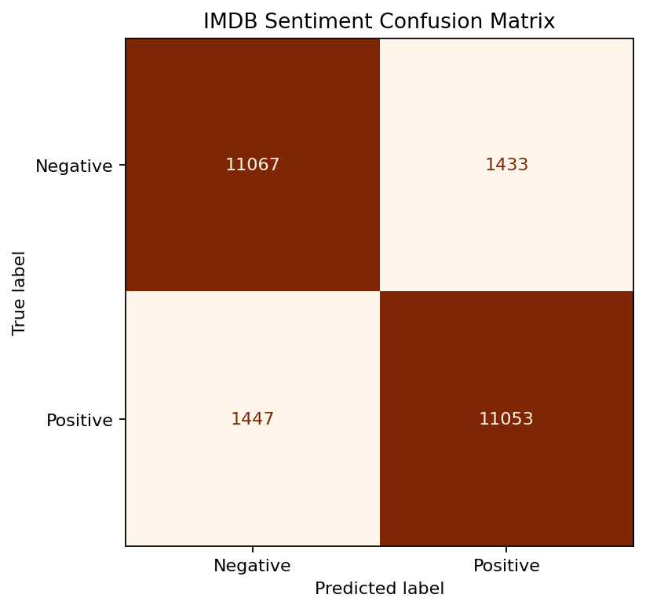

# IMDB Sentiment Analysis

An end-to-end sentiment analysis project built on the IMDB movie review dataset.

This repository upgrades a university ML assignment into a portfolio-ready project by adding:
- a reproducible project structure
- an interactive Streamlit demo
- a deployable sentiment pipeline for raw text input
- multilingual inference support for English and Greek input
- clear setup and execution instructions

## Result Snapshot

- Deployable TF-IDF + Logistic Regression pipeline accuracy: `0.8848` on the IMDB test set
- Precision: `0.8852`, Recall: `0.8842`, F1-score: `0.8847`
- Evaluation artifacts are stored in `model/metrics.json` and `docs/assets/confusion_matrix.png`

## App Showcase

### Overview



### Greek Prediction Flow

This example shows Greek input being detected, translated to English, and then scored by the deployed classifier.



### English Prediction Flow

This example shows the model's native English inference path without translation.



### Evaluation Evidence

The app also embeds evaluation artifacts directly into the interface so the demo is backed by measurable model evidence.



## Results

Final deployable model:
- Model: `TF-IDF + Logistic Regression`
- Dataset: `IMDB`
- Test samples: `25,000`

Performance summary:
- Accuracy: `88.48%`
- Precision: `88.52%`
- Recall: `88.42%`
- F1-score: `88.47%`

Confusion matrix:



## Why This Project Stands Out

- moves beyond notebook-only experimentation into a usable product demo
- lets a reviewer interact with the model through raw text input
- shows both ML understanding and practical packaging for deployment
- is easy to explain in a CV, interview, or portfolio walkthrough

## Problem

The goal is to classify IMDB movie reviews as positive or negative and present the final result through an interface that is easy for a non-technical reviewer to test.

## Approach

The repository combines two layers of work:

1. Academic experimentation in the notebook
	- custom Naive Bayes and Logistic Regression implementations
	- evaluation with precision, recall, and F1-score
	- learning curve analysis and model comparisons

2. Deployable inference pipeline for the demo
	- IMDB reviews decoded back into raw text
	- TF-IDF vectorization with unigram and bigram features
	- Logistic Regression selected as the final deployable model
	- serialized pipeline loaded directly by the Streamlit app

## Project Structure

```text
sentiment-analysis-imdb/
├── .streamlit/
│   └── config.toml
├── scripts/
│   ├── train_pipeline.py
│   └── evaluate_model.py
├── app/
│   └── app.py
├── model/
│   └── sentiment_pipeline.pkl
├── notebooks/
│   └── assignment.ipynb
├── docs/
│   ├── assets/
│   └── project_artifacts/
├── requirements.txt
└── README.md
```

## Demo

Run locally:

```bash
streamlit run app/app.py
```

Then enter a movie review and get an instant sentiment prediction.

Example:
- Input: `This movie was amazing, emotional, and visually stunning.`
- Output: `Positive`

Greek example:
- Input: `Πολύ καλή ταινία με εξαιρετικές ερμηνείες.`
- Processing: auto-translated to English before inference
- Output: `Positive`

The app also displays:
- prediction confidence
- class probabilities
- model summary metrics
- detected input language
- translated model input for non-English reviews
- embedded confusion matrix and evaluation evidence
- project framing that makes the demo easier to present

For reproducible evaluation outside the interface, see `model/metrics.json` and `docs/assets/confusion_matrix.png`.

## Multilingual Input Handling

The deployed classifier is trained on English IMDB reviews, so English remains the model's native inference language.

To improve usability for Greek input, the app now:
- detects the input language automatically
- translates Greek reviews to English before inference
- shows the translated text used by the model
- warns when prediction confidence is low

This is a more honest and production-like solution than pretending the underlying classifier is natively multilingual.

## How To Export The Model

The Streamlit app expects a serialized pipeline at `model/sentiment_pipeline.pkl`.

Recommended reproducible workflow:

```bash
python scripts/train_pipeline.py
python scripts/evaluate_model.py
```

This produces:
- `model/sentiment_pipeline.pkl`
- `model/training_summary.json`
- `model/metrics.json`
- `docs/assets/confusion_matrix.png`

1. Open the notebook inside `notebooks/assignment.ipynb`
2. Run the new export section at the end of the notebook
3. Confirm that `model/sentiment_pipeline.pkl` has been created

The notebook now also contains an evaluation cell that exports:
- `model/metrics.json`
- `docs/assets/confusion_matrix.png`

## What The Project Shows

- classical NLP baselines on IMDB
- custom implementations of Naive Bayes and Logistic Regression
- comparison with library-based models
- learning curves and evaluation metrics
- a usable application layer for demonstration purposes
- conversion of notebook work into a deployable inference pipeline

## Setup

```bash
pip install -r requirements.txt
```

## How To Run

```bash
streamlit run app/app.py
```

Open the local Streamlit URL in your browser, paste a review, and inspect the returned sentiment and confidence scores.

Note: Greek input support uses runtime translation, so an internet connection is required when scoring non-English text.

`localhost` is normal for local development and demonstrations. If you want a more public-facing presentation later, the natural next step is to deploy the app to Streamlit Community Cloud or another hosting platform.

## Deployment

The repository is now structured to be deployment-ready for Streamlit Community Cloud.

Recommended deployment target:
- repository root: `sentiment-analysis-imdb`
- app entrypoint: `app/app.py`
- dependencies: `requirements.txt`
- Streamlit config: `.streamlit/config.toml`

Typical deployment flow:

1. Push the repository to GitHub
2. Sign in to Streamlit Community Cloud
3. Create a new app from the repository
4. Set the main file path to `app/app.py`
5. Deploy and wait for the build to finish

After deployment, replace the local-only demo flow with your public Streamlit URL in the README and CV.

## Interview-Ready Talking Points

- turned a university assignment into a portfolio-ready ML application
- selected a deployable text pipeline instead of exposing only notebook experiments
- balanced academic evaluation with product-style usability
- added multilingual input handling while keeping the deployed model aligned with its English training distribution
- packaged the final model so non-technical users can test it directly

## Suggested CV Bullet

Built an end-to-end sentiment analysis project on the IMDB dataset, implementing custom ML models, evaluating them with precision/recall/F1, and packaging the best pipeline into an interactive Streamlit demo for live inference.
